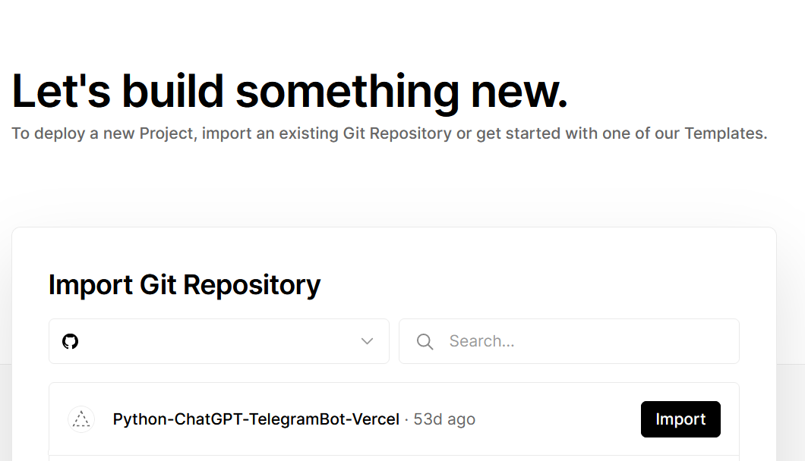
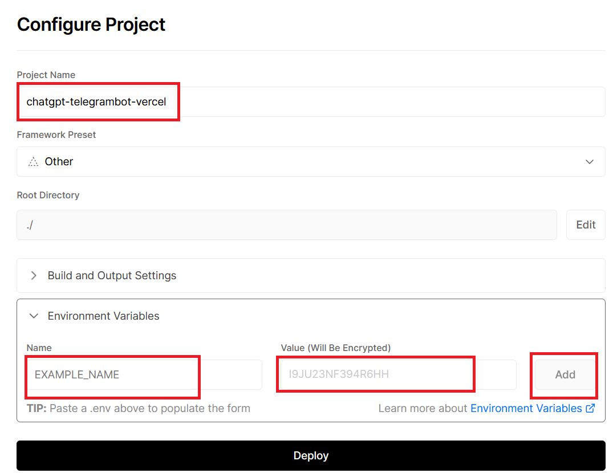

# FastAPI-ChatGPT3.5-linebot-Vercel
- 一個使用FastAPI框架和Langchain，創造一個linebot，快速建置於平台Vercel。

#### 1. 註冊Vercel帳號後，import已經fork過來的本專案。

  

#### 2. 必須在Vercel的Environment Variables設定3個環境變數，分別是OPENAI_API_KEY和LINE_CHANNEL_ACCESS_TOKEN和LINE_CHANNEL_SECRECT。順便記下Vercel給的網址，可以自己縮短一些。

  

#### 3. Deploy之後，在LINE developer設定webhook URL即可，測試OK，就可上路。

------
### Line和openai api設置請參考： https://github.com/howarder3/GPT-Linebot-python-flask-on-vercel

### FastAPI Vercel設置請參考： https://github.com/hebertcisco/deploy-python-fastapi-in-vercel